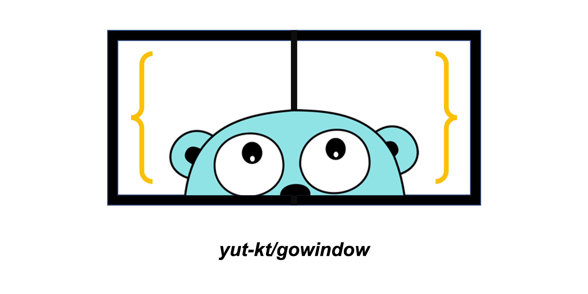

# gowindow

**Window Function support for Go language**



*Gopher image by [Renee French][rf], licensed under [Creative Commons 3.0 Attributions license][cc3-by].*

[](https://github.com/yut-kt/gowindow/releases)
[](https://github.com/yut-kt/gowindow/actions/workflows/default_branch_test.yaml)
[]()
[](https://goreportcard.com/report/github.com/yut-kt/gowindow)  
[](https://pkg.go.dev/github.com/yut-kt/gowindow)
[](https://raw.githubusercontent.com/yut-kt/gowindow/main/LICENSE)


## Install
```bash
$ go get github.com/yut-kt/gowindow
```

## Usage
See [gowindow_test.go](https://github.com/yut-kt/gowindow/blob/main/gowindow_test.go) for detailed Usage

## Supported window function
*[a list of window function](https://en.wikipedia.org/wiki/Window_function#A_list_of_window_functions)*
- Rectangular window
- B-spline windows
  - Triangular window
  - Parzen window
- Other polynomial windows 
  - Welch window
- Sine window
  - Power-of-sine/cosine windows
- Cosine-sum windows
  - Hann and Hamming windows
  - Blackman window
  - Nuttall window, continuous first derivative
  - Blackman–Nuttall window
  - Blackman–Harris window
  - Flat top window
  - Rife–Vincent windows
- Adjustable windows
  - Gaussian window
  - Confined Gaussian window
  - Approximate confined Gaussian window
  - Generalized normal window
  - Tukey window
  - Planck-taper window
  - ~~DPSS or Slepian window~~
    - Difficult to implement
  - Kaiser window
  - Dolph–Chebyshev window
  - Ultraspherical window
  - Exponential or Poisson window
- Hybrid windows
  - Bartlett–Hann window
  - Planck–Bessel window
  - Hann–Poisson window
- Other windows
  - ~~Generalized adaptive polynomial (GAP) window~~
    - Difficult to implement
  - Lanczos window

## Benchmark
https://github.com/yut-kt/gowindow/wiki/Benchmark

## License
gowindow is released under the [MIT License](https://raw.githubusercontent.com/yut-kt/gowindow/main/LICENSE).

[rf]: https://reneefrench.blogspot.com/
[cc3-by]: https://creativecommons.org/licenses/by/3.0/